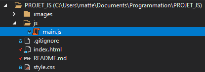

# SuperHeroProject

## Introdution_au_projet

Ce projet consiste � r�cup�rer des donn�es d'un fichier json, les filtrer, tout �a � l'aide d'un fichier JavaScript et enfin, d'afficher les donn�es filtrer dans un tableau dans une page html. 

## Comment_l'utiliser

Pour utiliser ce projet vous devez simplement lancer le ficher .html dans le dossier projet.

## Arborescence_du_projet
Notre arborescence du projet ressemble � ceci : 

On a : 
 - Un dossier ou l'on met nos images comme pour celle ci-dessus
 - Un dossier js ou l'on met notre script 
 - Notre fichier html pour afficher les donn�es
 - Un fichier .gitignore pour ignorer les fichier ou dossier inutile � �tre partag� au autres
 - Le README.MD
 - Et le fichier style.css pour personaliser la page
## Organisation_du_code
Notre code est organiser en plusieurs fonctions dans le fichier main.js voir [arborescence](#Arborescence_du_projet)
## R�partition_des_t�ches
On a r�parti les taches entre tout les membres de sorte � ce que personne ne fasse la meme chose pour �viter les probl�mes :

**- Yann :** Fonction recherche, Paginations, tri des noms,
**- Matteo :** Gestion du projet : Github,git,Trello, ReadMe.
**- Nicolas :** Powerstats, r�cup�rer les donn�es du json et affichage de données du personnage (powerstats)
**- Luke :** affichage des données de chaque personnage (icone, nom, nom complet, race, gendre, taille, poids, lieu de naissance et l'alignement), CSS, partie du ReadMe;
 
## Choses_�_revoir_ou_�_am�liorer
 - La compreh�nsion de Github
 - Meilleur gestion des branches 
 - 
